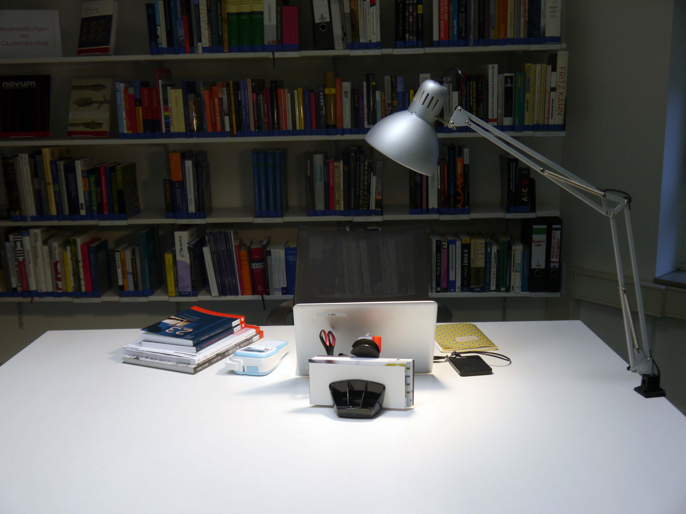
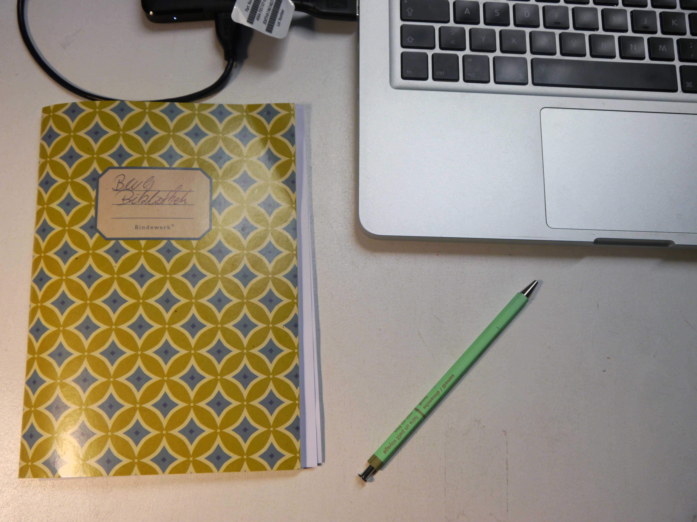
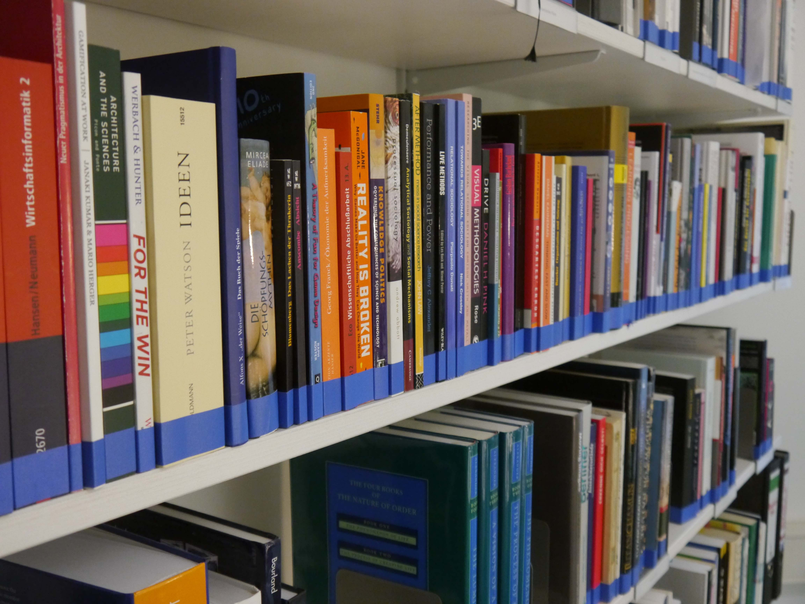
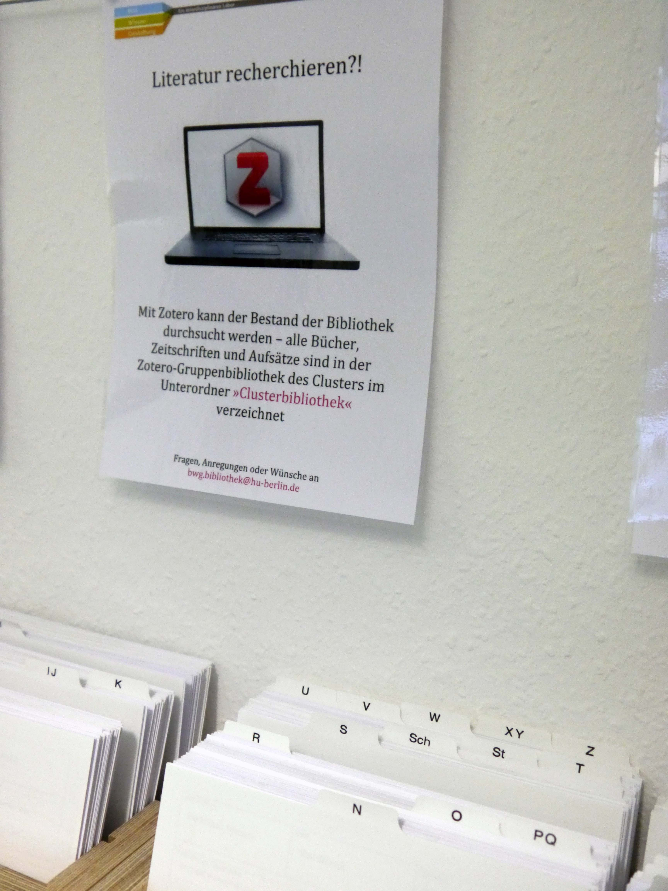

Zeigen Sie uns den Ort in Ihrer Bibliothek, an dem Sie die meiste Zeit verbringen. Was ist das für ein Ort? Wieso sind Sie die meiste Zeit dort?
================================================================================================================================================

Den Großteil meiner Zeit verbringe ich an diesem Schreibtisch. Er bildet
den zentralen Punkt der Einraum-Bibliothek und bietet ausreichend Fläche
für Laptop und Materialien zur Einarbeitung und Pflege der Medien. Der
Schreibtisch grenzt unmittelbar an die Bücherregale an, so dass ich
kurzerhand an die Schriftwerke gelangen kann. Des Weiteren bin ich von
dort aus für die NutzerInnen leicht aufzufinden, da sich der
Eingangsbereich direkt gegenüber befindet. Dieser Ort scheint nicht nur
für mich, sondern auch für die NutzerInnen der Bibliothek ein beliebtes
Plätzchen zu sein.

Was würden Sie vermissen, wenn es nicht mehr da wäre? Wieso würden Sie es vermissen?
====================================================================================

Da ich eine begeisterte Anhängerin von analogen Notizen bin, würde ich
vor allem mein kleines Arbeitstagebuch vermissen. Auf diesen Papierbögen
halte ich eine Fülle an gebündelten Informationen (wie zum Beispiel
Aufgaben, Wünsche oder Termine) fest. Zusätzlich angereichert wird das
Heft mit kleinen Notizen, auf denen mir KollegInnen oder NutzerInnen
Anfragen oder Anmerkungen hinterlassen. Die Inhalte stellen auf diese
Weise sowohl Dokumentation als auch Gedankenstütze dar. Sicherlich
würden die Arbeitsabläufe auch ohne diese Aufzeichnungen gelingen, wären
dann jedoch weniger gut organisiert.

Was stört Sie an Ihrer Bibliothek beziehungsweise was würden Sie gerne verbessern? Wieso stört Sie das jetzt (noch)?
====================================================================================================================

Die Bibliothek verfügt über eine ganz klassische Problemzone: Platz. Die
Raumausstattung wurde für eine kleine Bibliothek konzipiert, demzufolge
ist die vorgegebene Stellfläche äußerst limitiert. Der Bestand ist in
den vergangenen Jahren so stark angestiegen, dass es sich allmählich als
schwierig erweist, die Medien in den Regalen aufzubewahren und sie
zugleich übersichtlich zu präsentieren. Nicht nur zwischen den Büchern
wird es langsam eng, sondern auch in den Kästen, in denen sich die
Karteikarten für die Ausleihe befinden. In naher Zukunft müssen hierfür
definitiv Lösungsansätze gefunden werden.

Zeigen Sie uns Spuren der Bibliotheksnutzung. Gibt es dazu eine Geschichte?
===========================================================================

Mit Sicherheit haben die Karteikarten im Laufe der Zeit ein wenig von
ihrem ursprünglichen Glanz verloren. Interessanter sind für mich jedoch
die "digitalen Spuren", die sich nach und nach auf meinem Arbeitslaptop
angesammelt haben. So lassen sich mittels der Dokumente im
Dateiverzeichnis sowohl Bestandswachstum als auch die Erweiterung des
Leistungsspektrums seit Beginn der Bibliothek nachverfolgen.

Was haben Sie, was die anderen nicht haben? Warum haben Sie das? Sollten andere es auch in ihren Bibliotheken haben?
====================================================================================================================

Neben dem zuvor erwähnten "Karteikarten-Ausleihsystem" zählen die
Erfassung und Verwaltung der Medien mithilfe des
Literaturverwaltungsprogramms Zotero zu einem weiteren Charakteristikum
der Bibliothek. Die Einträge in Zotero sind für die Forschenden online
einsehbar, so dass ihnen die Möglichkeit geboten wird, im
Bibliotheksbestand zu recherchieren. Ein positiver Nebeneffekt ist die
erhöhte Sichtbarkeit und (hoffentlich) auch die Verwendung von
Literaturverwaltungsprogrammen im Allgemeinen.

Ihre Bibliothek (Name, Adresse, Spezialisierung, was man noch über sie wissen sollte)?
======================================================================================

Die One Person Library des Exzellenzclusters »Bild Wissen Gestaltung.
Ein Interdisziplinäres Labor« der Humboldt-Universität zu Berlin stellt
circa 700 ausleihbare Medien für die hiesigen Forschenden zur Verfügung.
Obwohl die Bibliothek gemessen an ihrer Medienanzahl einen
überschaubaren Bestand aufweist, ist sie thematisch dennoch breit
gefächert aufgestellt. Die Medieninhalte orientieren sich an den Themen
der Forschungsprojekte, so dass vor allem interdisziplinäre
Forschungsliteratur bereitgestellt wird. Fernerhin beherbergt die
Bibliothek die Handapparate einzelner Projekte der Einrichtung. Die
Bibliothek existiert seit 2013 und wird seit Beginn von studentischen
Hilfskräften verwaltet und weiterentwickelt.
