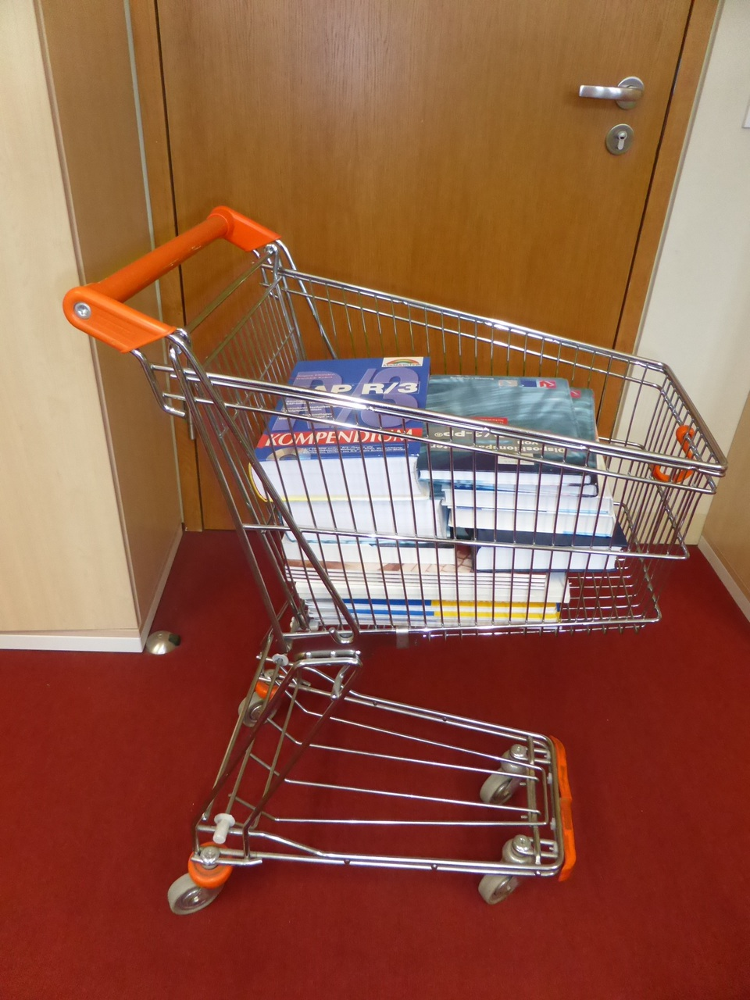
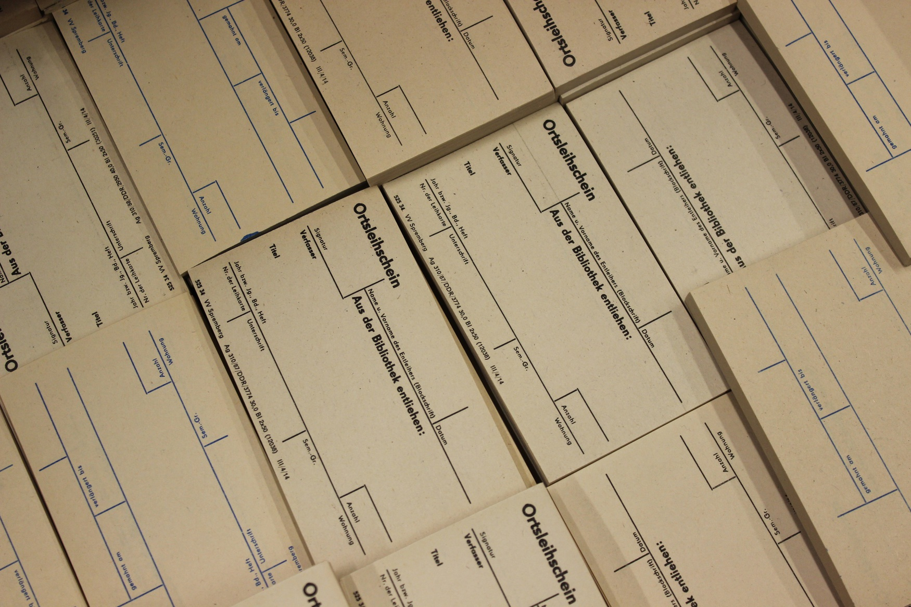
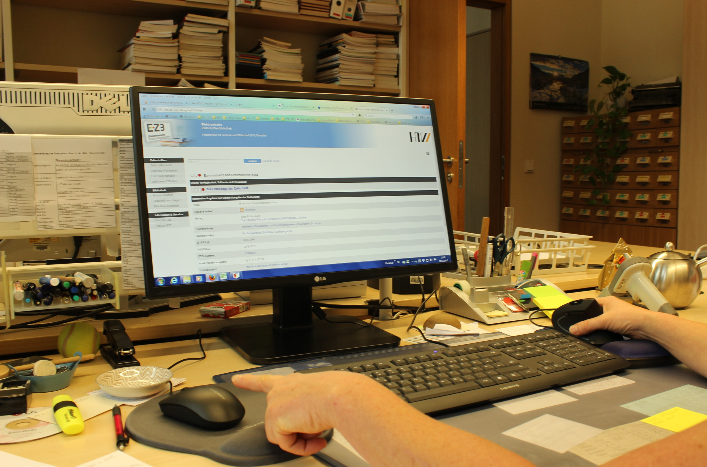
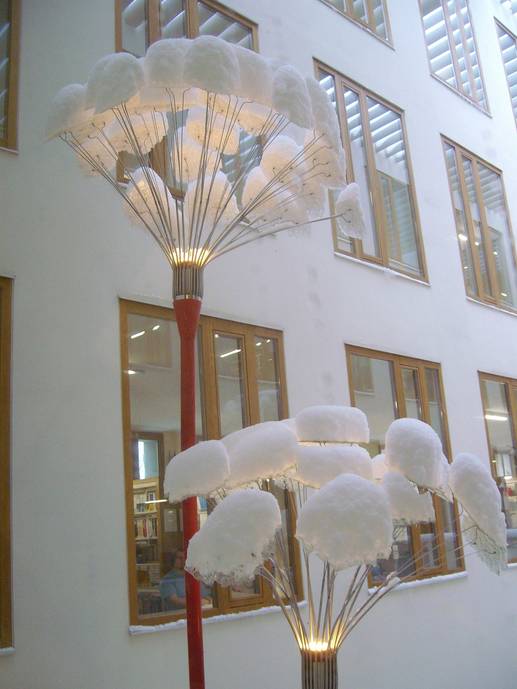
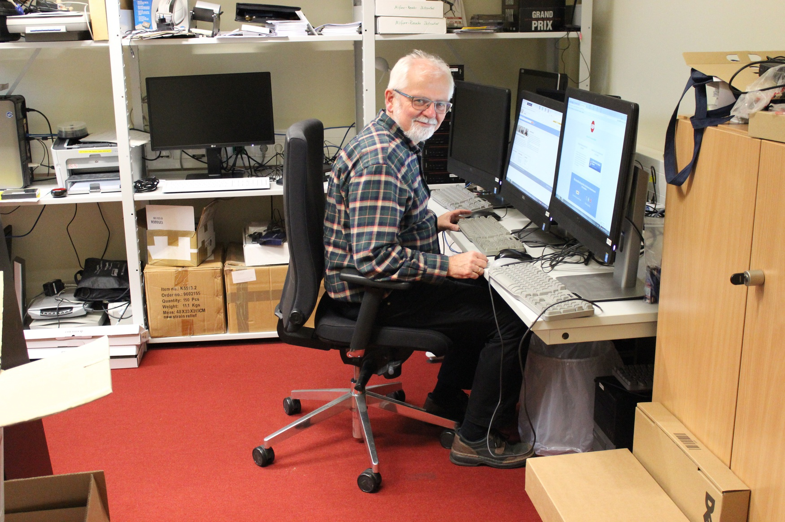
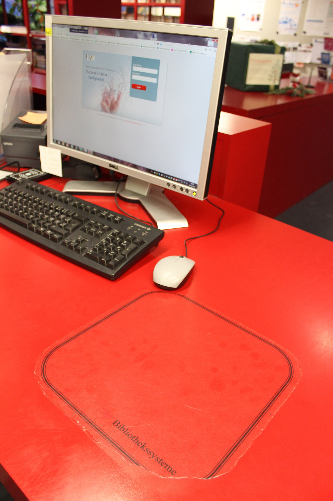

Zeigen Sie uns den Ort in Ihrer Bibliothek, an dem Sie die meiste Zeit verbringen. Was ist das für ein Ort? Wieso sind Sie die meiste Zeit dort?
================================================================================================================================================

Dieser gefüllte Bücherwagen ist ein freudiger Anblick für mich, denn wir
erwerben nicht nur E-Books, sondern auch noch sehr viele Printbücher.
Das lässt mein Herz als Bibliotheksassistentin höher schlagen. Das gute
Stück ist flexibel einsetzbar. Wir nutzen ihn nicht nur um unsere Bücher
einzustellen, sondern auch für den Transport von Geschirr für
Veranstaltungen, Gartengießkannen für Bibliothekspflanzen und andere
Utensilien. Er ist wendig und passt auch durch die kleinsten Gänge.

Der Prototyp stammt noch aus der DDR-Zeit und war damals als
Einkaufswagen in DDR-Kaufhallen im Einsatz. Erworben haben wir ihn in
den Nachwendejahren und er und neun andere Einkaufswagen sind seit
nunmehr 25 Jahren in unserer Bibliothek zu finden. Dieses Gefährt
erleichtert uns die Arbeit und ist aus unserem Bibliotheksalltag nicht
mehr wegzudenken.

\~ Kerstin, Erwerbung, im Team seit 1979

Im Zeitalter der Technik sind solche Papier-Leihscheine natürlich nicht
mehr in Gebrauch.[^1] Doch würde es wider Erwarten zu einem Stromausfall
oder technischen Problemen kommen, sind diese Relikte aus der
Vergangenheit bei uns sofort wieder im Einsatz. So können wir unseren
Nutzern auch ohne Stromversorgung noch die gewünschten Bücher ausleihen.
Beim Ausfüllen des Leihscheins müssen wir Bibliothekare mittlerweile
aber helfen, da die Leser von heute damit nie konfrontiert wurden und
sich eher schwertun. Wenn aber alle Stricke reißen, sind wir auf jeden (Not-)Fall vorbereitet.

\~ Rossi, Katalogisierung, im Team seit 1973

Gemütlich auf dem Sofa sitzen, den Laptop auf dem Schoß und in den
elektronischen Medien seiner Bibliothek stöbern, sie erkunden, lesen und
dabei sein Wissen mehren... oh du schöne Studentenzeit!

Aber was bedeutet das für uns Bibliotheksmitarbeiter, die sich um die
E-Medien für unseren Studenten auf dem Sofa kümmern?

Wir "data librarians" haben kaum noch ein Buch, das klassische Medium
der Bibliotheken, in der Hand. Vielmehr verbringen wir unseren
Arbeitstag vorrangig am Bildschirm, arbeiten mit Identifiern,
Datenquellen, Metadaten, Lizenzen, elektronischen Sammlungen,
Portfolios, und Linkresolvern. Das Gebiet der E-Medien entwickelt sich
enorm dynamisch und hält ständig Neuerungen bereit. Wir Mitarbeiter in
der Bibliothek müssen "dran bleiben" an den technischen Entwicklungen,
uns informieren sowie lernbereit und ständig offen für Neues sein.

Nicht zuletzt ist die tägliche Bildschirmarbeit aber auch ein harter Job
für Augen, Schultern und die Maus-Hand. Um aber die einseitige Belastung
für Schulter und Hand besser zu verteilen, arbeite ich daher mit 2
Mäusen -- vormittags rechts und nachmittags links. Zu Beginn stellte
sich die linke Hand (als Rechtshänder) recht störrisch und ungelenk an.
Mit etwas Geduld war es mir irgendwann möglich, mit der linken und der
rechten Hand zu arbeiten und ich möchte jedem Bildschirmarbeiter
empfehlen, dies auszuprobieren. Es lohnt sich! Da sich die rechte Hand
aber immer mal wieder vordrängelt, spendierte ich ihr eine 
anatomische Maus (für 20 €) -- dies ist meine zweite Empfehlung.

Und der Student auf dem Sofa? Gehen wir davon aus, dass er fündig wurde
und ohne Problem zu seinem gewünschten Volltext gelangte.

\~ Ute, Metadaten, im Team seit 2003

"Ein Garten ist für die Seele wie ein Buch für den Geist" -- da lag es
für das Dresdner Künstlerehepaar Hempel nahe, eine
Glasblumeninstallation in das Herz der Bibliothek zu setzen. Die
fragilen Blumen im Atrium sind Sommers wie Winters Wind und Wetter
ausgesetzt, dennoch "blühen" sie geschützt zwischen den Grundmauern im
Inneren der Bibliothek. Sie bilden nicht nur einen wirkungsvollen
Kontrast zur Schlichtheit der Architektur des Gebäudes, sondern auch zur
Sachlichkeit der Bücher. Doch mit ihrem durchsichtigen, zerbrechlichen,
bei Dunkelheit erleuchteten Glas stehen sie für mich auch noch für etwas
Anderes: den Auftrag der Bibliothek, die Grundsätze geistiger Freiheit
zu wahren, freie sowie allgemein zugängliche Quellen bereitzustellen und
dadurch die informationelle Grundversorgung sicherzustellen -- ein
elementares Grundrecht, das, genauso wie unsere Glasblumen, bei jedem
Wetter, beschützt und bewahrt werden muss.

\~ Rebecca, Informationsvermittlung, im Team seit 2015

Was würden Sie vermissen, wenn es nicht mehr da wäre? Wieso würden Sie es vermissen?
====================================================================================

Auf die Frage, was ich vermissen würde in der Bibliothek, wenn es nicht
mehr da wäre, fallen mir spontan ganz viele Dinge ein. Zuallererst das
gedruckte Buch. Es wäre für mich sehr schmerzlich, wenn keine gedruckten
Bücher mehr in den Regalen der Bibliothek stehen würden. Bücher machen
eine Bibliothek erst zu einer Bibliothek. Als zweites denke ich an die
Nutzer unserer Bibliothek. Für sie sind wir da, sammeln Informationen,
erschließen diese, stellen sie für sie bereit und helfen ihnen, die
Informationen zu finden. Unsere Nutzer sollen sich bei uns wohlfühlen,
gerne zu uns kommen, die Bibliothek als dritten Ort wahrnehmen. Was wäre
unsere Arbeit ohne sie? Dann gibt es noch so viele (technische)
Hilfsmittel, die einem die Arbeit erleichtern, die man auf keinen Fall
missen möchte und auf die man auch gar nicht mehr verzichten könnte.

Aber am Ende habe ich mich für meinen Kollegen entschieden, der im
nächsten Jahr in den Ruhestand geht und mich durch meine Ausbildung und
ersten Arbeitsjahre begleitet hat. Ihn werde ich vermissen, als Mensch,
Kollegen und Freund. Ich habe sehr viel von ihm gelernt, er hat mich
mitgenommen, unterstützt und motiviert. Er ist immer ein Ansprechpartner
für mich. Der Wandel im bibliothekarischen Tätigkeitsfeld ist rasant.
Fähigkeiten, die vor 20 Jahren wichtig waren, wurden abgelöst oder sind
obsolet. Mein Kollege bestärkte mich daher darin, ein Fernstudium zu
beginnen. Veränderungen muss man mutig begegnen, denn selbst wenn man
lieber an den alten Gewohnheiten festhalten möchte, ist doch das Leben
und damit auch die Arbeit etwas, das von Veränderungen lebt.

\~ Katja, Zeitschriften, im Team seit 1998

Zeigen Sie uns Spuren der Bibliotheksnutzung. Gibt es dazu eine Geschichte?
===========================================================================

Kurz vor dem Umzug der Bibliothek in unseren Neubau vor nunmehr elf
Jahren führten wir die Verbuchung und Buchsicherung über RFID ein. Neben
zahlreichen anderen Auswirkungen auf die verschiedensten Arbeitsschritte
in der Bibliothek wirkt sich diese Technologie auch auf die Handgriffe
während der Ausleihe aus: Der Handscanner entfällt und die Bücher müssen
nicht mehr zum Scannen gehoben und gedreht werden, sondern werden
einfach "über die Theke geschoben".

Damit ist der Thekenaufkleber, welcher die Platzierung der RFID-Antenne
markiert, ein Zeichen

a\) für die Entlastung der Mitarbeiter von monotonen Bewegungen und

b\) dass auch im Zeitalter von Digitalisierung und E-Medien das "alte
Medium" Buch geachtet und genutzt wird.

\~ Sabine, Benutzung, im Team seit 1981

Ihre Bibliothek (Name, Adresse, Spezialisierung, was man noch über sie wissen sollte)?
======================================================================================

Bibliothek der Hochschule für Technik und Wirtschaft (HTW) Dresden

Beantwortet wurden diese Fragen jeweils von sechs Mitarbeiterinnen aus
dem Bibliotheks-Team, unterschiedlich lange im Dienst und in
verschiedenen Arbeitsgebieten tätig. Das Team besteht aus 13
BibliotheksmitarbeiterInnen sowie zwei Auszubildenden. Der Bestand ist
wirtschaftswissenschaftlich-technischer Natur und umfasst circa 175.000
Printmedien sowie zahlreiche elektronische Angebote auf einer Fläche von
2461 m².

[^1]: \[Anm. d. Red.: Dass Leihscheine andernorts noch in Gebrauch sind,
    zeigt der Beitrag zur Bibliothek des Landesarchivs Berlin in dieser
    Ausgabe.\]
