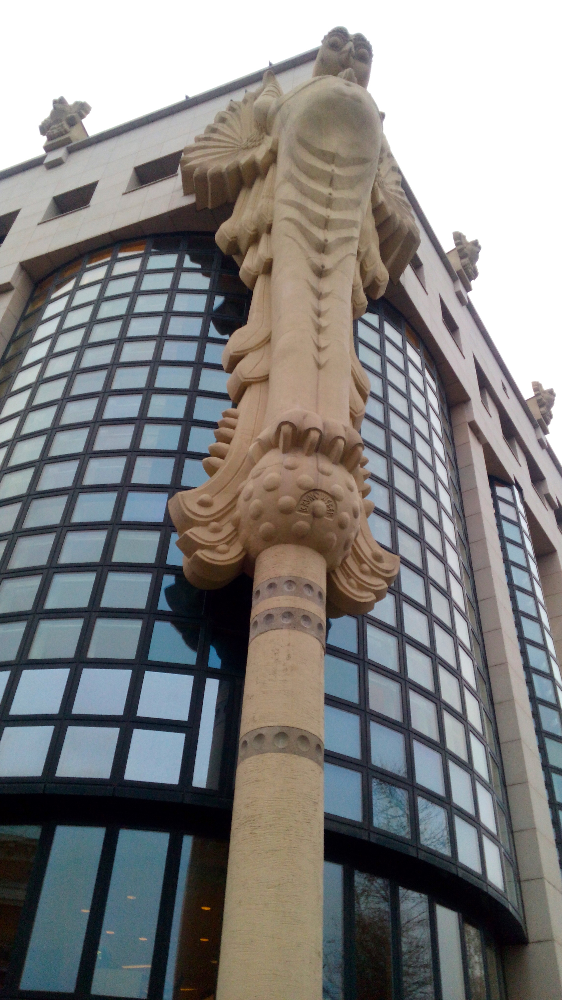
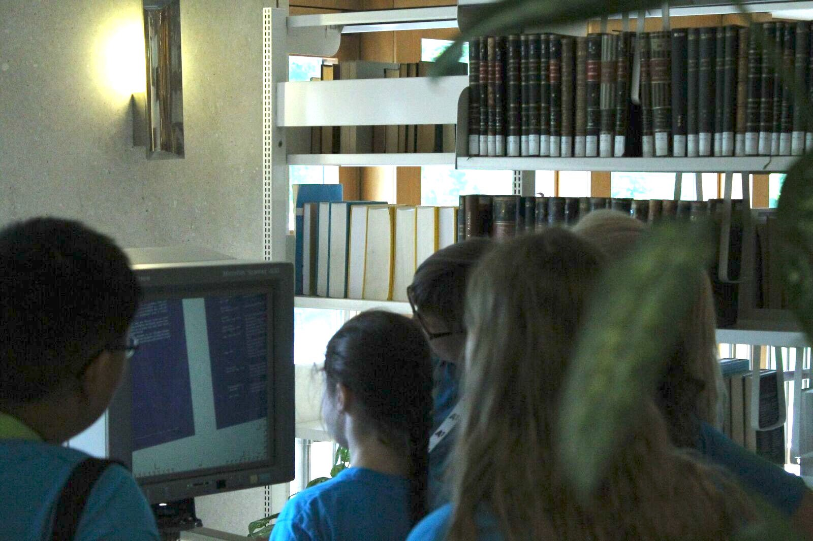
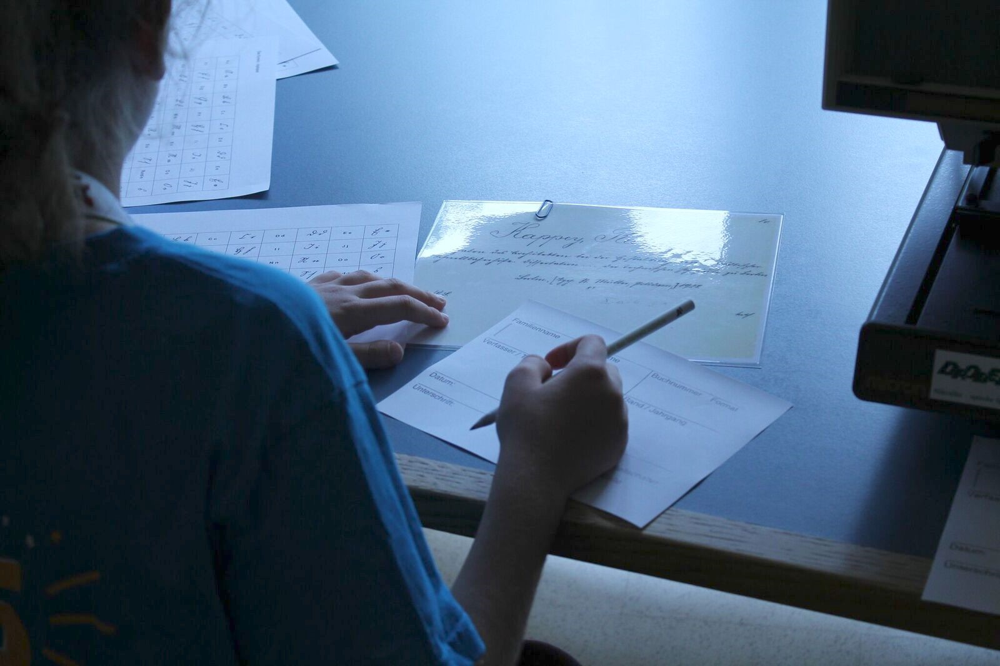
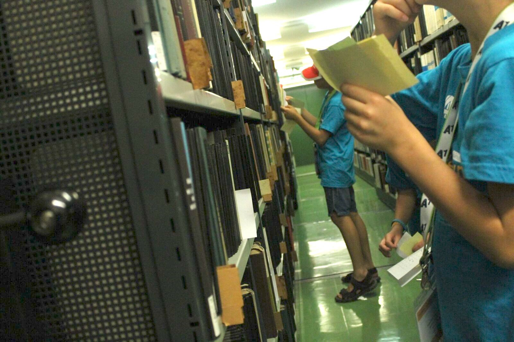
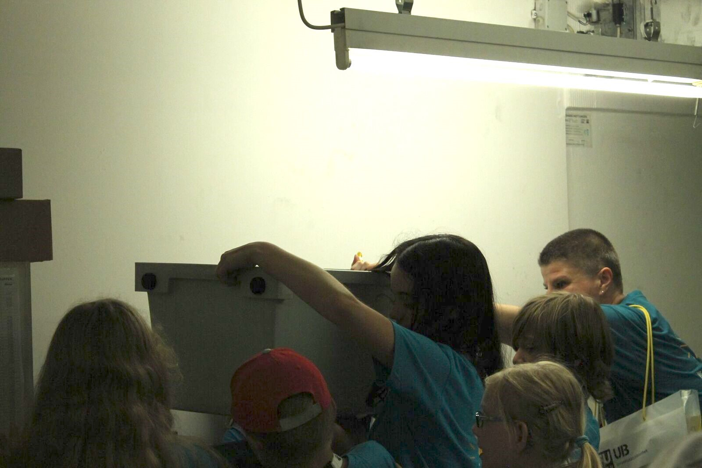
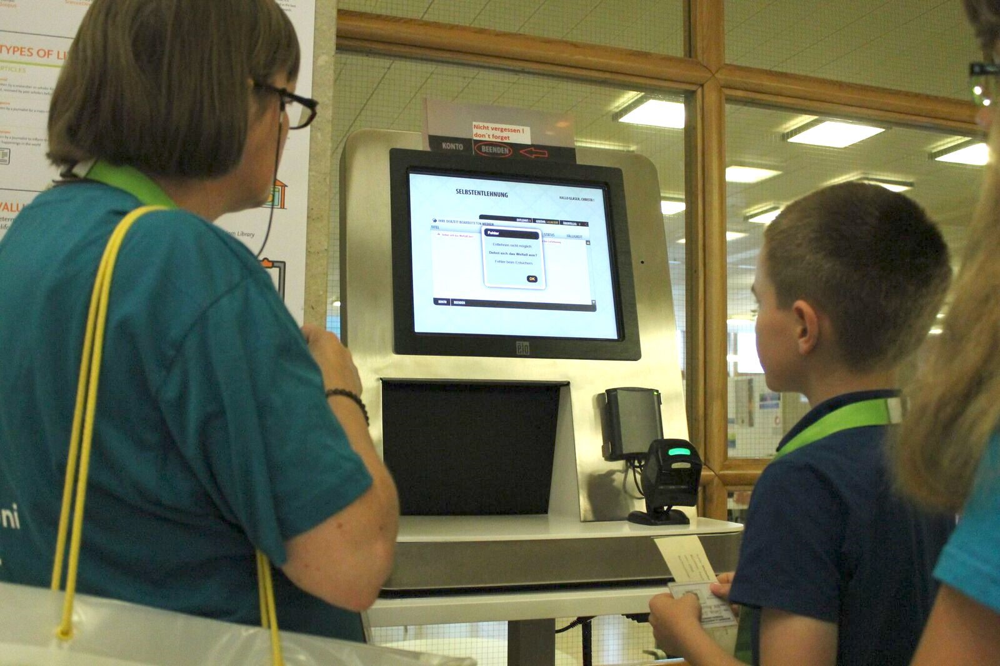

Im Jahr 2017 fand die 10. KinderuniTechnik im Rahmen der 15.
KinderuniWien statt. Die KinderuniWien zählt zu den größten
Wissenschaftsvermittlungsprojekten in Europa mit jährlich mehr als 4.000
teilnehmenden Kindern, 600 WissenschafterInnen und rund 450
Lehrveranstaltungen an sechs Wiener Universitäten und einer
Fachhochschule. Seit dem Jahr 2009 nimmt auch die Universitätsbibliothek
der Technischen Universität Wien an der KinderuniTechnik im
Rahmenprogramm teil. Es werden in der zweiten Juliwoche, über das
Kinderunivorlesungsverzeichnis, zwei jeweils eineinhalbstündige
Workshops für maximal 15 Kinder im Alter von 10 bis 12 Jahren angeboten.

Wir haben unseren Workshop anfangs mit dem Titel
"Bibliotheks-ErforscherInnen gesucht!" und danach unter "Was versteckt
sich hinter der Eule?" angeboten, da unser Bibliotheksgebäude durch eine
18 Meter große Eule an der Außenfassade geprägt wird.

Nach einer sehr kurzfristigen Übernahme des
Kinderuni-Bibliotheks-Workshops von einem sehr erfahrenen Kollegen, der
den Vergleich des Internets mit gedruckten Büchern zum Schwerpunkt hatte
, wollten meine Kollegin Christa Glaser und ich ein neues
Workshopkonzept den KinderunistudentInnen anbieten und waren damit in
den vergangenen fünf Jahren sehr erfolgreich.

Der Workshop hat mehrere Stationen und führt die TeilnehmerInnen vom
vierten Obergeschoss bis ins dritte Untergeschoss unseres
Bibliotheksgebäudes. Sie schlüpfen zuerst in die Rolle eines
Bibliotheksbesuchers / einer -besucherin und im zweiten Teil dann in die
eines Bibliothekars / einer Bibliothekarin. Nach einer kurzen Begrüßung,
einer Vorstellung des Ablaufs sowie der Personen werden sie anhand von
Schätzfragen an die Bibliothekszahlen und Benutzungsregeln herangeführt.
Die Kinder werden anschließend gemäß den Benutzungsregeln mit unseren
durchsichtigen Bibliobags ausgestattet, die vorbereitete Suchaufgaben
beinhalten.

Zuerst wird den Kindern die Funktionsweise des Online-Katalogs, der eine
Suche nach ganz konkreten wissenschaftlichen Inhalten oder Werken
ermöglicht, erklärt. Danach wird das Prinzip der Freihandaufstellung,
der Aufstellungssystematik und der Adjustierung der Bücher in den
Bücherregalen gezeigt. Mit diesem Wissen suchen die Kinder im
Online-Katalog nun selbständig nach dem Standort "ihrer" Bücher. Bei der
Auswahl der Suchbeispiele wird darauf geachtet, dass sich die Bücher
nicht über Augenhöhe der Kinder sowie in einem überschaubaren
Regalbereich der Bibliothek befinden und auch möglichst weit von den
Benutzerarbeitsplätzen entfernt sind, um die StudentInnen, die
normalerweise sehr tolerant und auch durch Plakate auf den Besuch der
KinderunistudentInnen aufmerksam gemacht worden sind, möglichst wenig zu
stören. Es ist sehr schön mitzuerleben, welches Erfolgserlebnis es für
die Kinder bedeutet, das "richtige" Buch dann aus der Vielzahl an
Büchern aus dem Regal zu ziehen.

Jetzt beginnt der Teil des Workshops, der sich mit Wissenspeicherung
abseits der digitalen Erfassung widmet. Die nächste Station ist der
Mikrofichearbeitsplatz, wo alle verfügbaren Geräte aufgestellt werden.
Nach einem Ratespiel, einem kurzen geschichtlichen Abriss und der
Erklärung der Geräte wird von den Kindern eine Suchaufgabe auf den
Mikrofichen gelöst. Besondere Begeisterung ruft immer der lesbare
Papierausdruck eines negativen Fiches hervor.

Da ein Großteil unseres alten Autorenkataloges (bis 1930) noch nicht
über den Online-Katalog recherchierbar ist, lassen wir auch Bücher aus
unserem alten Zettelkatalog suchen. Dafür haben wir einige geeignete
Beispiele ausgewählt und Kopien der in Kurrentschrift beschriebenen
Katalogzettel foliert. Die Transkription für den Eintrag der notwendigen
Felder auf unseren Bestellscheinformularen können die Kinder mit Hilfe
von Transkriptionslisten meist in Zweiergruppen bewerkstelligen.

Mit den ausgefüllten Bestellscheinen in der Hand switchen alle
TeilnehmerInnen in die Rolle von BibliothekarInnen und haben nun die
Möglichkeit in die verschlossenen Magazinsbereiche im dritten
Untergeschoss der Bibliothek zu gelangen, wo unsere alten Bücher
aufbewahrt werden. Die mit alten Büchern gefüllten Kompaktregalanlagen
versetzen die meisten Kinder in ehrfürchtiges Staunen. Es wird ihnen
schon vorab erklärt, nach welchem System hier die Bücher aufgestellt
sind (innerhalb der Formate im Numerus Currens). Auch hier ist jedes
gefundene Buch ein Erfolgserlebnis und der dafür als Platzhalter
eingelegte Bestellschein erleichtert uns im Nachhinein auch die
Rücksortierung.

Das Bewegen der einzelnen Kompaktregale, die ein mit einem kleinen
Elefanten vergleichbares Gewicht haben, macht den Kindern großen Spaß.
Die gefundenen Bücher werden dann mit Hilfe unseres Bücherlifts in das
Erdgeschoß geschickt, wo sich die Ortsleihe befindet, und von dort auch
gleich von den jungen BibliothekarInnen abgeholt.

Um den logischen Kreislauf zu schließen, können hier von den Kindern --
wieder in der Rolle als BibliotheksbenutzerInnen -- die Bücher entweder
am Schalter oder eigenständig am Selbstverbucher ordnungsgemäß entlehnt
werden. Es wird auch getestet, was passiert, wenn man mit einem
unverbuchten, also nicht entsicherten Buch durch die Sicherungsschranke
geht. Als Andenken bekommen die TeilnehmerInnen von uns ein Lesezeichen,
auf dem unsere Eule abgebildet ist, sowie einen Stempel in ihrem
Studienausweis, den sie ausgefüllt für ihre Sponsion
(Urkundenverleihung) benötigen.

Wir haben uns beide spontan und freiwillig dazu entschlossen, diesen
Workshop zusätzlich zu unserer alltäglichen Arbeit in dieser Form zu
organisieren, da wir davon überzeugt sind, damit einen nicht unwichtigen
Beitrag zur Bibliothekskompetenz recht junger Menschen zu leisten. Wir
konnten immer wieder feststellen, welch große Wirkung unser Workshop auf
etwaige zukünftige BibliotheksbenutzerInnen hat, da wir schon mehrfach
gefragt wurden, ab welchem Alter man bei uns eine
Bibliotheksbenützerkarte lösen kann oder von einer sehr aufgeweckten
jungen Dame sogar "Was muss ich tun, damit ich Bibliothekarin werde?".
Das Erfolgsgeheimnis ist eine sehr gute Vorbereitung hinsichtlich des
zeitlichen und räumlichen Ablaufs und bei der Erklärung sämtlicher
Zahlen und Fakten möglichst bildhafte Beschreibungen zu verwenden. Der
Workshop ist auch durch ständiges gegenseitiges Fragenstellen
gekennzeichnet. Es machte uns jedes Jahr aufs Neue sehr große Freude,
nicht nur das bibliothekarische Wissen, sondern auch die Begeisterung
für unseren Beruf den KinderunistudentInnen zu vermitteln.
