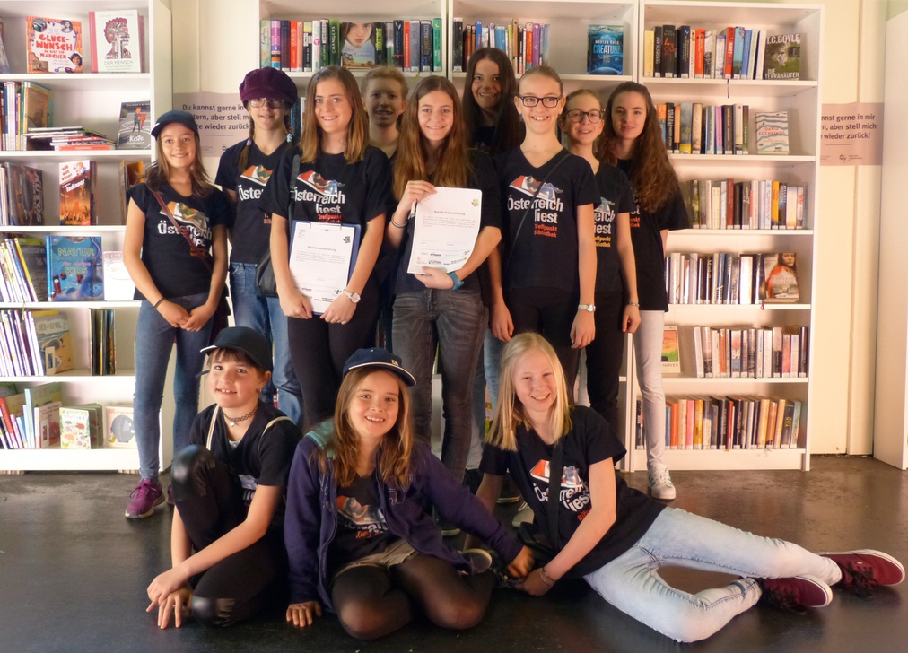
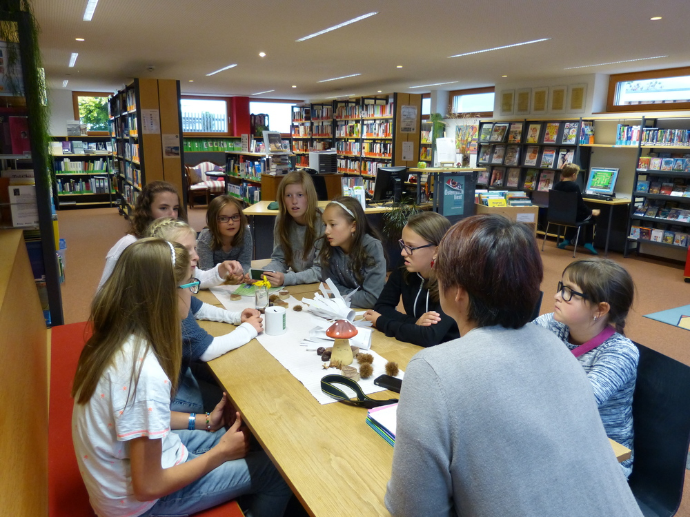

### Das Jugendteam der Walserbibliothek Raggal

*Franziska, Julia, Helena, Viktoria, Janine, Nina, Luisa, Leonie, Leonora, Mia*

Wir sind derzeit zehn Kinder und Jugendliche zwischen 8 und 17 Jahren
und bilden das Jugendteam der öffentlichen Bibliothek "Walserbibliothek
Raggal" (Vorarlberg/Österreich). Die Hauptaufgabe unseres Teams besteht
in der eigenverantwortlichen Organisation, Koordination und Gestaltung
der speziell eingeführten Jugendöffnungszeiten jeden Freitag von 17.00
bis 18.30 Uhr. Zudem gestalten wir selbst kleine Veranstaltungen für
Jugendliche, werden an der Entscheidungsfindung, der Planung und
Durchführung von Veranstaltungen für Kinder und Jugendliche aktiv
beteiligt und führen von Zeit zu Zeit Projekte durch (aktuelles Projekt:
"Plastiktaschen RAUS -- Stofftaschen REIN"[^1]). Wir unterstützen das
Bibliotheksteam bei seiner Arbeit und helfen aus, wenn es Engpässe bei
der Abdeckung der Öffnungszeiten oder durch Ausfälle von
Mitarbeiterinnen gibt. Betreut werden wir von der Bibliotheksleiterin,
die vor allem die Koordination und Informationsweitergabe zwischen dem
Jugend- und dem Bibliotheksteam (Teamsitzung) übernimmt. Zur
Eigenständigkeit des Jugendteams gehört auch ein eigenes Budget für
Medieneinkäufe und Veranstaltungen und vollkommene
Entscheidungsfreiheit.

Die Anforderungen, die an uns junge Bibliothekarinnen gestellt werden,
sind Selbständigkeit in der Durchführung der gesamten Bibliotheksarbeit
sowie spontane und kreative Eigeninitiative in der Gestaltung der
Jugendöffnungszeiten und bei Veranstaltungen für Jugendliche.

Wir arbeiten gerne im Jugendteam der Walserbibliothek, weil uns die
Bibliotheksarbeit Spaß macht, weil wir mitbestimmen und gestalten
dürfen, weil wir viel gemeinsam erleben, weil es da so viele spannende
Medien gibt, weil die Bibliothek ein Treffpunkt ist\...

### Die Sicht der Bibliothek

*Verena Burtscher*

Klaudia Büchel ist seit 2002 als ehrenamtliche Bibliotheksleiterin in
der Walserbibliothek Raggal tätig und gründete im Jahre 2004 ein
*Jugendteam*, welches seither fester Bestandteil der Bibliothek ist. Sie
ist überzeugt, dass eine derart gestaltete Partizipation die Integration
einer "Jugendbibliothek" vor allem in kleineren Bibliotheken mit
begrenzten Räumlichkeiten ermöglicht. So wird die Bibliothek zum
Freizeitort für Jugendliche und es kann auf deren besonderen Bedürfnisse
und aktuellen Anforderungen gezielt eingegangen werden.

Die Jugendbibliotheksarbeit dient als Freizeitgestaltung und wirkt sich
insofern positiv aus, dass das Medienangebot verstärkt in Anspruch
genommen wird und die Jugendteammitglieder ihre Familien und Freunde mit
Medien versorgen. Der selbstbestimmte Ankauf von Medien durch die
Jugendlichen, unter Berücksichtigung der Buchwünsche Jugendlicher,
animiert verstärkt auch andere Jugendliche zum Lesen. Zudem fördert die
gemeinsame Bibliotheksarbeit die Medien- und Sozialkompetenz und
ermöglicht das Kennenlernen und Mitgestalten von Organisationsprozessen.
**Die Bibliotheksarbeit durch Jugendliche macht die Bibliothek zum
Freizeitort und wirkt sich positiv auf das Nutzungsverhalten, die
Nutzungsfrequenz und die Lesemotivation Jugendlicher aus.**

Die ehrenamtliche Bibliotheksarbeit im Jugendteam stärkt zudem das
Selbstvertrauen der Jugendlichen im Umgang mit verschiedensten Medien,
in der Ausführung der selbständigen Bibliotheksarbeit sowie im Auftreten
gegenüber anderen. Das Zugehörigkeitsgefühl hat vor allem bei jüngeren
Teammitgliedern und da besonders bei Kindern aus eher bildungsfernen
Familien eine besondere Bedeutung. Die gemeinschaftliche
Bibliotheksarbeit erfordert Teamfähigkeit sowie Verlässlichkeit und
fördert die Sozial-, Medien- und Informationskompetenz der Jugendlichen.
Die Eigeninitiative zu sozialem Engagement wird gefördert und hält auch
über das Jugendteam hinaus an, was sich in der Vorbildfunktion und
Verantwortungsübernahme ehemaliger Mitglieder für das Jugendteam zeigt,
die von sich aus neue Mitglieder schulen und beratend zur Seite stehen.
Die Bibliothek als Freizeitort sowie die Betreuung in den
Jugendöffnungszeiten durch das Jugendteam fördert die Kommunikation
unter Jugendlichen und hat Auswirkungen auf die Sozialkompetenz anderer
Jugendlicher, die freiwillig in der Bibliothek oder bei Veranstaltungen
mithelfen und sich bei Projekten sozial engagieren. **Die ehrenamtliche
Arbeit in der Bibliothek fördert die Sozial-, Medien- und
Informationskompetenz sowie die Kommunikation unter Jugendlichen und
wirkt sich positiv auf das soziale Engagement aus.**

Aus Sicht der Bibliotheksleiterin ergeben sich durch ein integriertes
Jugendteam für die Bibliothek vielfältige Möglichkeiten und Chancen.
Jugendliche wecken Interesse an der Bibliothek und an der
Bibliotheksarbeit und sind Informationsträger in der Öffentlichkeit.
Frühe und positive Bibliothekserfahrungen entwickeln ein Bewusstsein für
die Bibliothek, welches bis ins Jugendalter und darüber hinaus anhält
und fördern so die langfristige Bindung als Nutzer. Jugendliche wissen
am besten, wie sich Jugendliche ihre Bibliothek vorstellen und was sie
sich wünschen, weshalb die Bibliothek passende Nutzungsmöglichkeiten und
interessante Angebote für Jugendliche anbieten kann. Die
Bibliotheksarbeit durch Jugendliche hinterlässt ein positives
Bibliotheksimage bei Familien und Jugendlichen. Jugendliche als
Potential für die Bibliotheksarbeit zu erkennen, bedeutet nicht nur
Entlastung und Unterstützung des Bibliotheksteams, sondern auch, dass
vor allem die ehrenamtliche Bibliotheksarbeit durch ausreichenden
Nachwuchs gesichert werden kann. Wichtig dabei ist die Abgabe von
Verantwortung an Jugendliche. Die selbständige Bibliotheksarbeit eines
Jugendteams ist eine Möglichkeit, Lesen und Bibliothek als
Selbstverständlichkeit im Leben von Kindern und Jugendlichen zu
integrieren und so Einfluss auf die Lesemotivation durch positive
Bibliothekserfahrungen zu nehmen. Ein Jugendteam soll die Bibliothek als
Treffpunkt, als Lernort, als Gestaltungs- und Erfahrungsraum für
Jugendliche weiter etablieren. Ein leichter, unkomplizierter
Medienzugang für alle und die Betreuung durch das Jugendteam als
Vorbilder für Kinder und Jugendliche sollen das Lesen fördern und Bücher
und Literaturvermittlungsangebote speziell für die Zielgruppe
Jugendliche attraktiver machen.

Weitere Informationen auf:

<http://www.raggal.bvoe.at/jugendbibliothek>

<http://www.raggal.bvoe.at/leitpapier-jugendteam>

[^1]: <http://www.walserbibliothek.at/plastiktaschen-raus-stofftaschen-rein>